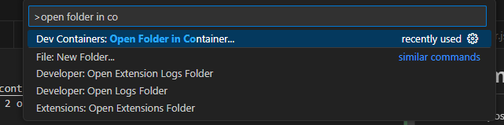

# c8sm
This repository contains a ready-to-use [devcontainer](https://containers.dev/) (tailored for VSCode),
which contains all the prerequisites to be able to skip Chapter 2 of the [C8SM Course](https://employee-academy.camunda.com/c8-self-managed-using-c8-helm-chart). 

If you're short on time, it provides a kickstart to get up and running fast whilst not polluting your own system with dependencies.

> [!NOTE]
> The container MAY also work with different IDEs than `VSCode`, as long as they support devcontainers.
> But The section "customizations.vscode.extensions" will definitely not. So for the best UX I'd recommend using VSCode.

# How to Use

## VSCode
Open the [Command Palette](https://code.visualstudio.com/docs/getstarted/userinterface#_command-palette)(Windows: `Ctrl+Shift+P`) and start typing: .

Hit `Enter` twice and let the magic happen!

In the end you'll find yourself in a ready to use devcontainer with all tools installed, required to complete the course.

## Todo's

* [ ] add pre-commit and config
* [ ] enable for renovate
* [ ] externalize base devcontainer
